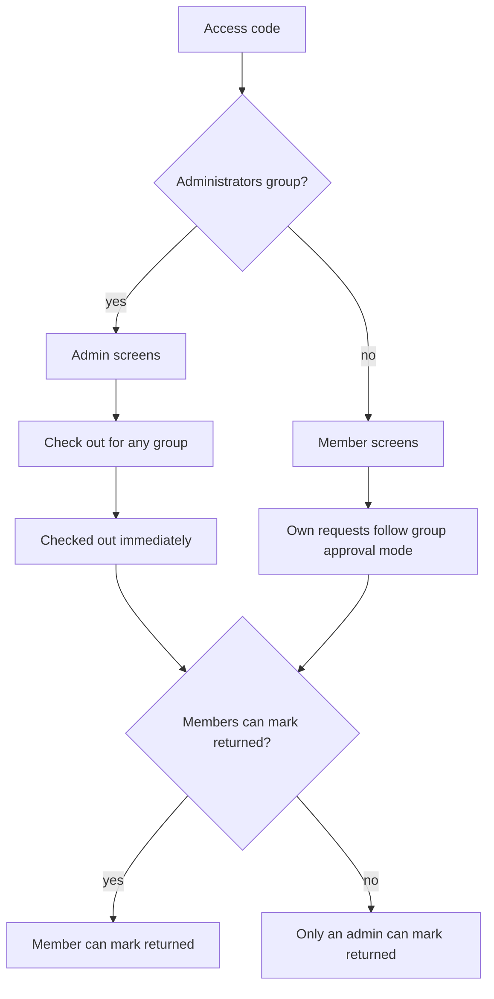

# Groups, codes, and checkout

## Log out and dialogs

- Add a **Log out** button in the header of [`components/shell/app-shell.tsx`](components/shell/app-shell.tsx), next to Help, using the existing `logout` action. The Account page already has one; this puts it on every screen.
- Help, deny, return, and access-code popups all use [`components/ui/dialog.tsx`](components/ui/dialog.tsx). [`app/globals.css`](app/globals.css) sets `dialog { background: transparent }`, which paints over the card color, so the text sits on the dim backdrop. Give the dialog a solid `var(--card)` background and keep the dark backdrop.

## Access lives on groups

Remove the **Users / Access** nav item from [`app/(main)/layout.tsx`](app/(main)/layout.tsx) and the [`app/(main)/admin/users/page.tsx`](app/(main)/admin/users/page.tsx) screen. Code management moves onto each group in [`components/admin/groups-manager.tsx`](components/admin/groups-manager.tsx).

On the Groups page, list existing groups first and put **Create group** underneath.

Each group card keeps its name and approval mode, and gains:

- A checkbox: **Members can mark items returned**
- A list of access codes for that group. Each code keeps a name (so history can still say who checked something out). There is no per-person role picker.
- **Add code**, **See current**, and **Rotate** for each code

**See current** opens the same style of dialog used today and shows the code that is stored now. **Rotate** replaces it and shows the new code. Today only a hash is stored, so the code cannot be shown again. Credentials will also store the code itself in the local store (still not sent to the browser until an admin clicks See current or Rotate). Codes that already exist only as hashes cannot be recovered; See current will say to rotate once, which then saves a viewable code.

## Administrators group

Add a built-in **Administrators** group (`grantsAdmin: true`). Every code in that group signs in as an administrator. Other groups stay members. The flag cannot be turned off, and the last code in that group cannot be removed.

On load of [`data/store.json`](data/store.json), if that group is missing, create it and move anyone whose role is already `admin` into it (the current admin is in Arduino). Login in [`src/actions/auth.ts`](src/actions/auth.ts) sets the session role from the group, not from a dropdown.

## Admin checkout for any group

On the admin Checked out page, add a form: choose any group, quantities, and an expected return date. Submitting creates a checked-out ticket immediately, even when that group normally requires approval, and even if the item is hidden from that group. Stock still has to be available.

The ticket is filed under the chosen group and recorded as created by the admin. Members of that group see it on their Checked out page, along with their own loans.

## Members marking returns

[`returnItems`](src/domain/requests.ts) is admin-only today. If the group’s **Members can mark items returned** box is checked, a member can mark returned on checked-out tickets for their own group (their own loans and admin-created tickets for that group). If it is unchecked, only an administrator can record the return. Admins can always mark any ticket returned.

Update the help text in [`src/content/help.ts`](src/content/help.ts) so it matches the new Groups screen, viewable codes, admin checkout, and the return setting.

